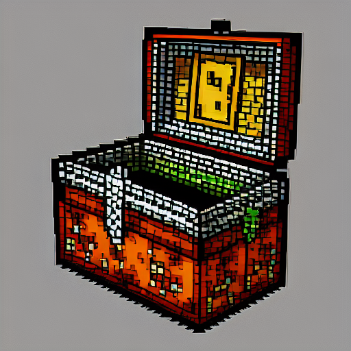

# Loot Config

## About

Minecraft mod for modifying the loot tables throughout Minecraft

As with the original inspiration of this mod it is the case that everytime a chest is generated in the world, 
it is not until the chest is opened for the first time that loot for it is generated. Therefore, this mod 
does not require the game to be restarted for the changes in the config file to take effect. However, 
once a chest is opened for the first time, the loot generated for said chest will not change unless 
there is a mod that regenerates the loot for the chest.

This mod provides direct support beyond what was provided by Chest Loot Modifier by Levonment including 
allowing modification to entities' and blocks' loot tables as well!

This mod is designed with the idea of overwriting other mods in mind if desired. Please read the full README.md

Please check out Levonment's mod here: https://github.com/Levoment/ChestLootModifier and give 
all the love and support you can <3

If you need any assistance in understanding the mod, you can join the Timefall discord here: https://discord.gg/EHrWY5ZTYQ

I will be happy to assist and hope this mod is useful to you!

## Configuration

A file named `settings_and_definitions_config.json` needs to exist on the `config` folder of the 
Minecraft instance that the mod is loaded on. The mod will automatically create a template 
for this file during initialization if the file doesn't exist. That means that if the file 
gets corrupted, you can always delete it and the mod will re-create a template for it.

Sample files can be found in the loot_config/example_config folder!

`LoadPoolsAtRuntime` - decides whether the pools are loaded when Loot Table Loading happens for 
the world or whether to load them when a loot table needs to be accessed. Default 
value is `false` which means the pools are loaded when the world is loaded. 
Being `false` might make the mod compatible with other mods. Making it 
`true` might make the mod incompatible with other mods. `true` is necessary if it is
desired to override loot table changes other mods have made.

`NameDefinitions` - Put `"AnyNameYouWant": ["lootTableID"]` to assign lootTableID's to a name
that will be used in the other two configs.

`LootPoolDefintions` - Put `"AnyNameHere": {//stuff}` to define a lootPool to use. The rolls
determine how many times the loot pool will attempt to generate an entry. You can use `RollSuccessChance`
to show how frequent a roll succeeds. Looting applies to entities, Bonus rolls apply to chests.
Conditions have their own explanation below. Entries allow you to put any item's id followed by
`[quantity, weight]` using integers.

`Conditions` - limit rolls to succeed only if the conditions are met.
`KilledByPlayer` does what it sounds like.
`LocationCheck_Biome` enables a check to ensure the drop can only be made in the specified biome.
`MatchTool_Enchantment` enables a check to see if the tool you are using has a specific 
enchantment of a designate-able level.
`SurvivesExplosion` does what it sounds like.
`WeatherCheck` allows you to set `RainingTrue` or `RainingFalse` or `ThunderingTrue` or 
`ThunderingFalse` or `RainingOrThundering` and whichever you set will be a requirement.

`"Vanilla"` can be used as a loot pool without needing to define it in the
settings config to denote wanting to generate the normal loot table of a table id.
Other loot pools can still be added to this loot pool collection.

## Issues
The mod has a lot of logic to print to the console when something fails. If the game crashes 
or if the loot doesn't seem to have been applied to the table ID, create an issue. You can also 
join the Timefall discord here: https://discord.gg/EHrWY5ZTYQ where I can provide direct support.

## The Future of Development

There are likely to be some initial bugs as the conditions are a bit complicated. Please report them,
give any feature requests, and report any grievances about ease of use in the aforementioned discord.
I'm looking to make this as easy to use as possible. Function application such as the set nbt loot function
will be implemented in a future update. Thank you for your support!

## Backporting or Forge? Rehosting?

No. Simply, I will never be porting this mod to forge, I have no interest in doing so. If anyone wishes to,
I have no objection. Please just provide a link back to this mod and levonment's mod is all I ask.
I will not be backporting except maybe to 1.18.x because before then, the fabric api lacks a good
way to modify loot tables. **PLEASE DO NOT REHOST THIS MOD**. It is rude, if you need it on somewhere other than
CurseForge, **TALK TO ME**. I will likely put it on Modrinth at some point. Please respect this. I will happily accept
any contributions anyone makes. Feel free to copy a large portion of this mod if you think you can do better!
I just wanted something like this to exist. Again, just provide a link back to me and levonment please. <3

## License

MIT

### Other

Icon drawn by Dream Studio AI art with prompt: Pixel art Treasure chest
